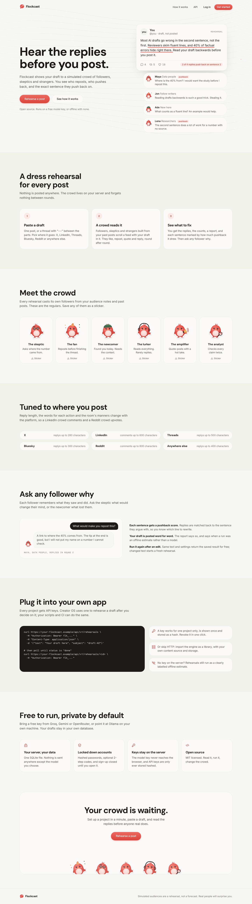
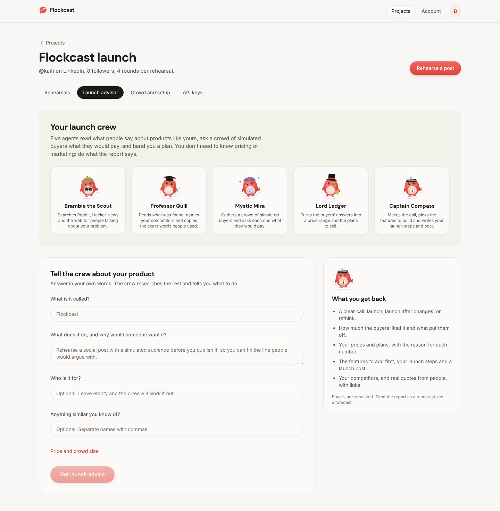
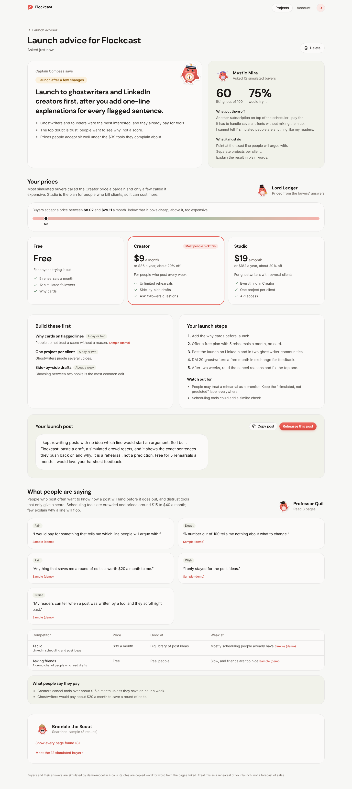

# Flockcast



Rehearse a post with a simulated audience before you publish it. Flockcast casts a crowd of followers that fits your account, lets them read your draft over a few rounds, and shows you which sentence they pushed back on, how they replied, and why. You can then ask any follower a question.

It comes three ways from one codebase:

- **An app**: accounts, projects (one per account you post from), rehearsals, results, follower interviews, API keys. Open `http://localhost:4180`.
- **An HTTP API** for other apps, with a key per project (`/api/v1`).
- **An engine** (`engine/`) you can embed in your own Node app, with adapters for where text comes from, where results are kept, and which model plays the audience.

Simulated audiences are a rehearsal, not a forecast. The app says so wherever it shows results.

## Launch advisor

Each project also has a **Launch advisor** for the product you are about to launch. Describe it in a few sentences and a crew of five agents does the rest, written for someone who has never priced or launched anything:

| Agent | Job |
|---|---|
| Bramble the Scout | Searches Hacker News and Reddit (no key needed) and, with a free `TAVILY_API_KEY`, the open web for people talking about the problem |
| Professor Quill | Reads what was found, names the competitors and copies the exact words people used, each linked to its page |
| Mystic Mira | Asks a crowd of simulated buyers how much they like it, what puts them off and what they would pay |
| Lord Ledger | Turns the buyers' four price answers (Van Westendorp) into an acceptable range and the plan prices, by arithmetic rather than by the model |
| Captain Compass | Makes the call (launch, launch after changes, or rethink) and writes the features to build first, the launch steps and a launch post you can rehearse |



A run is four model calls. Quotes that are not word for word in a page found are dropped. Without a model key the crew still searches and shows what it found, labelled as research only. Each project gets 5 runs a day (`ADVICE_PER_PROJECT_PER_DAY`).



## Run it

Needs Node 22.18 or newer. The server runs its TypeScript directly; only the web app has a build step.

```bash
npm install
npm run build:web     # builds the app into public/
cp .env.example .env  # optional; add a free model key here
npm start             # http://localhost:4180, then create your account
```

Without a model key every rehearsal is an **offline estimate**: a seeded, rule-based crowd, labelled as such, that cannot answer questions. Add a free key (Groq is the default) for real simulated replies.

Other commands:

```bash
npm run demo          # the app on :4180 with a built-in stand-in model, so every screen works with no key
npm test              # 40 tests: engine, advisor, adapters, accounts, API, isolation between accounts, security checks
npm run check         # typecheck server and web, then the tests
npm run dev           # server with reload; `npm run dev:web` for the web app with hot reload on :5173
npm run stickers      # regenerate the mascot sticker files
```

## Settings

All optional; see `.env.example`.

| Variable | Default | What it does |
|---|---|---|
| `PORT` / `HOST` | `4180` / `127.0.0.1` | Where the server listens |
| `REHEARSAL_DB` | `data/rehearsal.db` | The SQLite file |
| `NODE_ENV` | | `production` makes cookies `Secure` with the `__Host-` prefix; needs HTTPS |
| `TRUST_PROXY` | off | Read the visitor IP from `X-Forwarded-For` behind Render, Fly or nginx |
| `REHEARSAL_SIGNUP` | `closed` | `closed`: only the first account can sign up. `open`: anyone |
| `REHEARSAL_OWNER_EMAIL` | | On a public server, only this email can create the first account |
| `REHEARSAL_LLM_PROVIDER` | `groq` | `groq`, `gemini`, `openrouter`, `ollama`, `openai`, `custom` |
| `REHEARSAL_LLM_API_KEY` | | Free keys at console.groq.com, aistudio.google.com, openrouter.ai |
| `REHEARSAL_LLM_MODEL` / `_BASE_URL` | per provider | Override the model, or point `custom` at any OpenAI-compatible URL |
| `LLM_API_KEY` / `LLM_BASE_URL` | | Read when the `REHEARSAL_` ones are unset, so Creator OS's key works as is |
| `REHEARSAL_ENGINE` / `MIROFISH_URL` | `swarm` | `mirofish` uses a MiroFish server you run (see `sidecar/mirofish`) |
| `REHEARSALS_PER_SUBJECT_PER_DAY` | `10` | Spend cap per draft |
| `INTERVIEWS_PER_REHEARSAL` | `25` | Spend cap per rehearsal |

Per project, in the app: platform (X, LinkedIn, Threads, Bluesky, Reddit or generic), handle, audience segments, past posts (so the crowd is made of people who would follow you), crowd size and rounds.

## Defaults chosen

- Sign-up is closed: the first account owns the server. Open it with `REHEARSAL_SIGNUP=open`.
- Groq is the default model provider because its free tier is enough for daily use; any of the six presets works.
- The built-in engine (`swarm`) runs inside the server. MiroFish is optional and stays a separate AGPL service; no MiroFish code is in this repository.
- The platform is chosen per project, so one server can rehearse X threads and LinkedIn posts side by side.
- Light theme only, following the Charm design language.
- `package.json` is `"private": true`. Remove that when you publish the engine to npm.

## Using it from Creator OS or another app

See [docs/integration.md](docs/integration.md). In short:

- **Over HTTP**: make a project and a key in the app, then `POST /api/v1/rehearsals` with `Authorization: Bearer flk_...`. `examples/creator-os/http-client.ts` is a ready client.
- **As a library**: `createRehearsals({ store, engine, sources })` with your own adapters. `examples/creator-os/embed.ts` wires it into Creator OS's database, using a `flockcast_rehearsals` table (Creator OS already has a `rehearsals` table) and keeping rehearsal closed until the creator has decided on the draft.

## Deploy

- **Docker**: run `npm run build:web` first (the image copies the built `public/`), then `docker build -t flockcast . && docker run -p 4180:4180 -v flockcast-data:/app/data -e REHEARSAL_LLM_API_KEY=... flockcast`. The database lives on the volume.
- **Render**: `render.yaml` is a blueprint for a free web service with a disk. Set `REHEARSAL_LLM_API_KEY` and `REHEARSAL_OWNER_EMAIL` in the dashboard.

Put it behind HTTPS and set `NODE_ENV=production`, `TRUST_PROXY=1` and `REHEARSAL_OWNER_EMAIL` before sharing the URL.

## The mascot

Pip is Flockcast's plush coral bird, drawn as die-cut stickers in nine moods: plain, skeptic, fan, newcomer, lurker, amplifier, analyst, sleepy and oops. The app uses them for followers, empty states and errors. The launch advisor's crew are Pips too: Bramble the Scout (pith helmet and binoculars), Professor Quill (mortarboard and quill), Mystic Mira (turban and crystal ball), Lord Ledger (top hat, monocle and coin) and Captain Compass (captain's hat and compass). The SVG files are in `public_static/stickers/` (and in `stickers/` as SVG and PNG), free to use with Flockcast.

## More

- [docs/architecture.md](docs/architecture.md): how the pieces fit
- [docs/integration.md](docs/integration.md): HTTP API, adapters, Creator OS
- [docs/security.md](docs/security.md): each common web risk and how it is handled
- [sidecar/mirofish/README.md](sidecar/mirofish/README.md): running MiroFish beside Flockcast

MIT licensed. See `LICENSE`.
